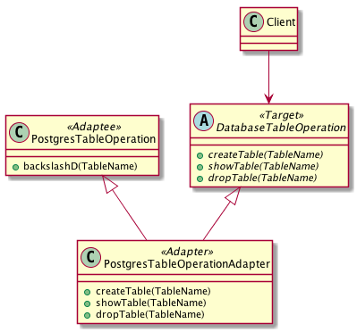

# Intent
Convert the interface of a class into another interface clients expect. Adapter lets classes work together that couldn't otherwise because of the incompatible interfaces.

# Also Known As
Wrapper

# Structure
To adapt an existing class, we can either 1) inherit the Target publicly and the Adaptee privately or 2) inherit the Target publicly but compose the Adaptee (object adapter).

# Credits
[Design Patterns: Elements of Reusable Object-Oriented Software](http://www.amazon.com/Design-Patterns-Elements-Reusable-Object-Oriented/dp/0201633612)
