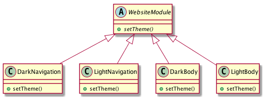
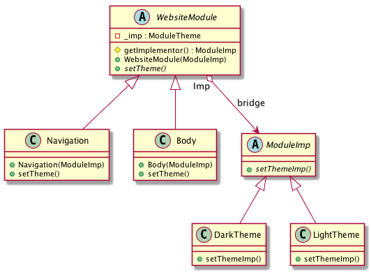

# Intent
Decouple an abstraction and its implementation so that the two can vary independently.

# Structure
There are two independent hierarchies, one for abstraction, the other for the implementation.

In the example, there are two website modules that can be implemented in Dark or Light theme.

Without Bridge pattern, the abstraction is extended by subclassing to cover all different kinds like below.

With Bridge pattern, it's conveninent to extend different abstactions and implementations.

The problem with the first approach is if we add another module called _Footer_, then we have to implement two subclasses, `DarkFooter` and `LightFooter`. But only one subclass of WebsiteModule is required with Bridge pattern.

# Credits
[Design Patterns: Elements of Reusable Object-Oriented Software](http://www.amazon.com/Design-Patterns-Elements-Reusable-Object-Oriented/dp/0201633612)
