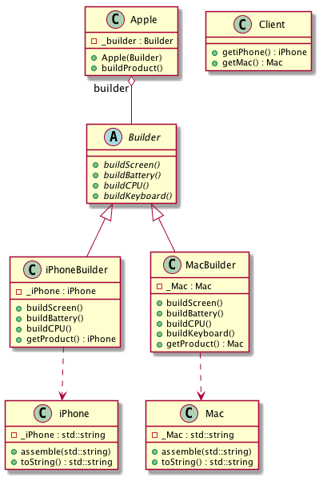

# Intent
The Builder pattern separates how a complex product (iPhone) is built and assembled.
So the same construction process can create different representations (Mac).

# Structure
In the example, _Apple_ is a Director that has an general interface defining how a product will be built by a builder.
Two builders, _iPhoneBuilder_ and _MacBuilder_ that actually build the apporiate product.
On the client side, it has the infomation about all the builders and products, it creates a builder and passes it as a parameter to a director it creates.
But only the director and the abstract builder know all the parts to build any type of products, the director notifies the builder whenever a part of the product should be built. Concrete builders handle the requests from director and add the parts to the product.

From the client and director point of view, the design pattern paramerizing the system relies more on **object composition**.

# Credits
[Design Patterns: Elements of Reusable Object-Oriented Software](http://www.amazon.com/Design-Patterns-Elements-Reusable-Object-Oriented/dp/0201633612)
