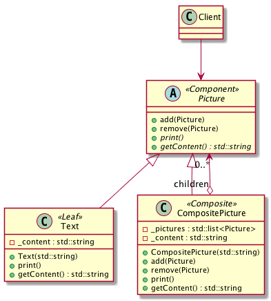

# Intent
Compose objects into tree structures to represent part-whole hierarchies. Composite lets clients treat individual objects and compositions of objects uniformly.

# Structure
The recursive composition is achived by aggregating multiple instances (pointers in the implementation) of the base class.

# Credits
[Design Patterns: Elements of Reusable Object-Oriented Software](http://www.amazon.com/Design-Patterns-Elements-Reusable-Object-Oriented/dp/0201633612)
