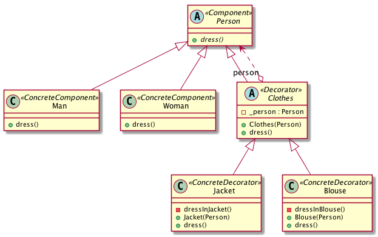
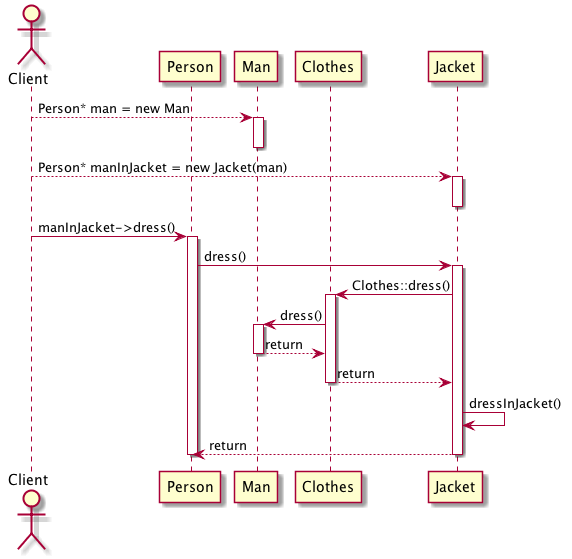

# Intent
Attach additional responsibilities to an object dynamically. Decorators privide a flexible alternative to subclassing for extending functionalities.

# Also Known As
Wrapper

# Structure
The decorator interface conforms to the interface of the component it decorates. Decorator is a skin over an object rather than changing its guts, Strategy is a better choice in situations where the component class is intrinsically heavyweight.

# Credits
[Design Patterns: Elements of Reusable Object-Oriented Software](http://www.amazon.com/Design-Patterns-Elements-Reusable-Object-Oriented/dp/0201633612)
