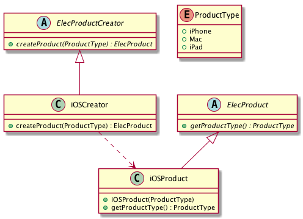

# Intent
Define an interface for creating an object, but let subclass decide which class to instantiate. Factory Method lets a class defer instantiation to subclasses.

# Also Known As
Vitual Constructor

# Structure
Factory method probably is the most common pattern that the designs start out with.
Instead of relying on object composition, once a different product is needed, we just create a subclass with different implementations from the base class, and then instantiate the subclass directly.
In the example, _ElecProductCreator_ is an abstract class, which is implemented by a concrete subclass, _iOSCreator_ where a specific product is created and returned. 

# Credits
[Design Patterns: Elements of Reusable Object-Oriented Software](http://www.amazon.com/Design-Patterns-Elements-Reusable-Object-Oriented/dp/0201633612)
