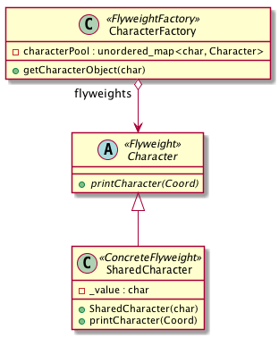

# Intent
Use sharing to support large numbers of find-grained objects efficiently.

# Structure
The intention of Flyweight is to save space when most of the objects share the intrinsic state. The intrinsic state is independent on the context. In this case, FlyweightFactory creates and manages flyweight objects that can be shared. Whenever a new object is needed, the client sends a requst to the factory where the object will be created and added to the flyweight pool.

There is a trade-off between run-time costs and space savings. The more flyweights are shared, the greater the storage savings.

# Credits
[Design Patterns: Elements of Reusable Object-Oriented Software](http://www.amazon.com/Design-Patterns-Elements-Reusable-Object-Oriented/dp/0201633612)
