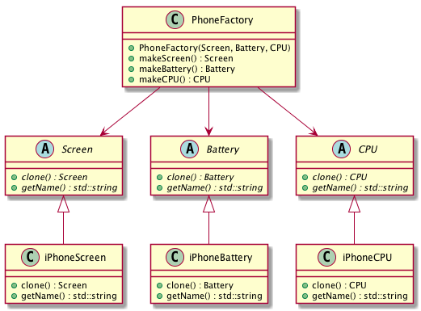

# Intent
Sepcify the kinds of objects to create using a prototypical instance, and create new objects by copying this prototype.

# Structure
Prototype is similar to Builder. Instead of passing a builder, it passes the instance of each parts, and the client can create a product either by the construtor or cloning the prototype.

Prototype relies on **object composition**.

