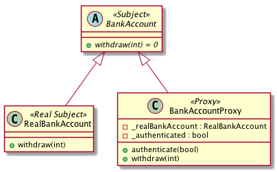

# Intent
Provide a surrogate or placeholder for another object to control access to it.

# Also Known As
Surrogate

# Structure
Proxy has four types: Remote Proxy, Virtual Proxy, Protection Proxy, Smart Reference. No matter which one is used, the Proxy and Real Subject subclass from Subject, Proxy may have extra functionalities and class members to handle the access. Lazy instantiation is typically used in Virtual Proxy.

# Credits
[Design Patterns: Elements of Reusable Object-Oriented Software](http://www.amazon.com/Design-Patterns-Elements-Reusable-Object-Oriented/dp/0201633612)
